# DeepSeekHW
My coursework for Deep Learning
- link to my Cloud Drive：https://kod.cuc.edu.cn/#s/_o6_XHsg

# Thesis Section
# DeepSeek Research: Principle Analysis, Application Fields and Optimization Solutions

## I. Key Words
Reinforcement learning, moments of Epiphany, Group Relative Strategy Optimization (GRPO), cold start, local cultural tourism industry

## Ii. Abstract
Based on the knowledge of neural networks and deep learning courses, this paper explores the core principles, technical optimization strategies and application scenarios of DeepSeek. The application mechanism of reinforcement learning in DeepSeek is analyzed emphatically. The improvement of the Group Relative Policy Optimization (GRPO) algorithm to the traditional PPO is proposed, and the stability of the model is enhanced by combining the cold start optimization scheme. Finally, look forward to the application prospects of DeepSeek in the local cultural tourism industry, such as personalized services and immersive technology integration.

## Iii. Analysis of Core Principles
Reinforcement learning Basic framework
- **Core Loop** : The Agent maximizes the long-term cumulative Reward through the loop of observing the State → performing actions → obtaining rewards.
- **The dual role of DeepSeek** : It is both the Agent that performs question-and-answer and the dynamic Environment that optimizes the output through self-reflection (such as analyzing the user's identity and needs).
- **Reward Model** : It includes accuracy rewards (matching user requirements) and format rewards (following output specifications, such as using specified labels to separate reasoning from answers).

### 2. Aha Moments
- **Definition**：DeepSeek dynamically adjusts the mechanism for allocating thinking time by re-evaluating the initial response strategy.
- **Performance**：Actively think about the answer content and show the same way of thinking as humans.

### 3. Reinforcement learning workflow in DeepSeek

## Iv. Technical Optimization Strategies
### 1. Core issue
- **Reward Hacking**：The model generates semantically incoherent texts (such as keyword stuffing) in pursuit of maximizing absolute rewards.
- **Reliance on supervised data**:RL relies on a large amount of supervised data.
- **The cold start is unstable**：In the initial training stage, the response logic is chaotic.

### 2. Improvement of the GRPO algorithm
#### (1) Contrast with PPO
| Algorithm | Optimization Objective | Core Mechanism | Supervisory Dependency | Reward Type |
|---|---|---|---|---|
|PPO| Maximize absolute rewards | Single Individual Output Optimization | High | Absolute Value |
|GRPO| Maximize Group Relative Rewards | Grouping mechanism + Dynamic Baseline + Standardization of Relative Rewards | Low | Relative Value |

#### （2）Key formula
- Calculation of relative advantage：  
$$A_i=\frac{r_i - \text{mean}(r_1, r_2, \dots, r_G)}{\text{std}(r_1, r_2, \dots, r_G)}$$  
Calculate the mean and standard deviation through multiple outputs of the same problem to generate standardized relative scores.
- Objective function：  
$$J_{GRPO}(θ)=E\left[\sum_{i=1}^G \min\left(\frac{π_θ(o_i)}{π_{θ_{\text{old}}}(o_i)}A_i, \text{clip}(\frac{π_θ(o_i)}{π_{θ_{\text{old}}}(o_i)}, 1-ε, 1+ε)A_i\right) - βD_{\text{KL}}(π_θ||π_{\text{ref}})\right]$$  
Introduce intra-group contrast and KL divergence constraints to suppress the semantic collapse caused by the maximization of absolute rewards.

#### (3) Advantages
- **Reduce supervisory dependence** : There is no need for manual annotation of answer quality, and the model generates the reward baseline by itself.
- **Enhance robustness** : Through relative reward optimization, solve the problem of keyword stuffing and improve the coherence of responses.

3. Cold Start Optimization Scheme
- **Implementation Method** : Fine-tune the initial RL model using a small amount of Long Chain Thinking (CoT) data as the actuator in the cold start stage.
- **Effect** : Fixed the multilingual mixing issue of DeepSeek-R1-Zero, forcing the output of a structured answer of "reasoning process → Result summary".

## V. Application Scenarios: Integration of local cultural Tourism industries
### 1. Core application direction

2. Specific scenarios
#### (1) Personalized travel assistant
- **Data Basis** : Scenic area traffic flow, consumption records, user profiles (such as the number of travelers, budget, time).
- **Function** : Generate customized routes (such as a 4-day tour of Beijing for 3 people), and provide historical explanations of scenic spots in combination with real-time positioning (such as on-site guided Tours of the Old Summer Palace).

#### (2) Immersive technology integration
- **Technology Integration** : Digital humans +AR+DeepSeek model, deployed on the official website of scenic spots or smart large screens, providing interactive cultural experiences.

#### (3) Cultural and tourism product innovation
- **Cultural Mining** : Build a cultural ontology library based on local knowledge bases (local Chronicles, folk customs) to support the design of cultural and creative products and the development of IP images.

### 3. Technical architecture

- **Data Layer** : Cultural and tourism statistics + cultural knowledge graph (historical events, character relationships, architectural styles).
- **Model Layer** : Retrieval Augmentation Generation (RAG) +DeepSeek+ Multimodal technologies (Digital humans, AR)+ Data analysis.

## Vi. References
[1] Mnih, V., et al. (2013). Playing Atari with Deep Reinforcement Learning. arXiv:1312.5602.  
[2] Simonds, T., et al. (2025). Self Rewarding Self Improving. arXiv:2505.08827.  
[3] Liu, A., et al. (2024). DeepSeek-V3 Technical Report. arXiv:2412.19437.  
[4] Guo, D., et al. (2025). DeepSeek-R1: Incentivizing Reasoning Capability in LLMs via Reinforcement Learning. arXiv:2501.12948.  
[5] Bi, X., et al. (2024). DeepSeek LLM: Scaling Open-Source Language Models with Longtermism. arXiv:2401.02954.

# Code Section

- This code implements a maze-solving agent using PPO and GRPO.（Maze_PPO.ipynb and Maze_GRPO.ipynb)
- In addition, I have provided the code for training the Qwen_1.5_instruct model using GRPO.(Using GRPO on Qwen_1.5_instruct.ipynb)
   - The main contributor of this code: aburkov(https://github.com/aburkov)

## 1. Maze Environment:
   - 10x10 grid with walls (1) and paths (0)
   - Start position (1,1) and goal (8,8)
   - State: Normalized agent position + goal position (4 values)
   - Rewards: 
     - +40 for reaching goal
     - Distance-based reward (moving closer to goal)
     - -0.05 per step penalty
     - -1.0 penalty for hitting walls

## 2. Policy Network:
   - 2 hidden layers (64 neurons each)
   - Actor: Outputs action probabilities
   - Critic: Estimates state value

## 3. Agent:
###  3.1 PPO Agent
   - Uses clipped surrogate objective
   - Entropy bonus for exploration
   - Advantage normalization
   - Discount factor (γ=0.95)
### 3.2 GRPO Agent
  - Reference policy updated periodically (every 10 updates)
  - KL divergence penalty (β=0.1) for policy stability
  - Clipped surrogate objective (ε=0.2)
  - Advantage normalization
  - Discount factor (γ=0.95)
## 4. Training:
   - Records trajectories
   - Computes returns and advantages
   - Updates policy using multiple epochs
   - Visualizes best path

### Training Parameters
| Parameter | Value | Description |
|-----------|-------|-------------|
| Episodes | 1000 | Training iterations |
| Max Steps | 200 | Maximum steps per episode |
| Learning Rate | 0.001 | Optimizer step size |
| γ | 0.95 | Discount factor |
| Clip ε | 0.2 | PPO clipping range |
| β | 0.1 | KL divergence coefficient |
| Epochs | 4 | Optimization epochs per update |
| Ref Update Freq | 10 | Reference policy update frequency |

## 5. Visualization:
   - Plots maze with agent path
   - Colors: green=start, red=goal, blue=path
   - Saves training metrics (rewards/losses)
   - PPO final result 46.5
   - GRPO final result 46.3

## 6. Comparative experiment
### 6.1 gamma=0.99
   - PPO final result 43.8
   - GRPO final result 47.5
### 6.2 learning rate=0.0001
   - PPO final result 44.3
   - GRPO final result 47.8
### 6.3 epoche=6
   - PPO final result 48.0
   - GRPO final result 46.1
### 6.4 beta=0.05
   - GRPO final result 44.1
